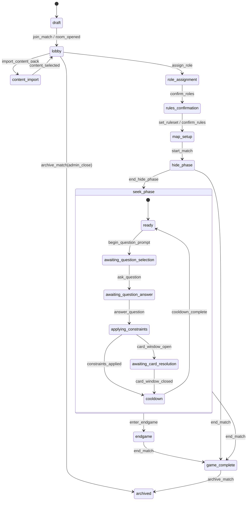

# State Machine

## Purpose

This document defines the authoritative match lifecycle for the generic transit hide-and-seek engine. Every gameplay or admin action must pass through a validated command handler. Clients never transition match state directly.

The state model is hierarchical:

- one top-level lifecycle state
- an optional nested substate for active seek flow
- a global `paused` overlay that suspends timers and preserves the interrupted state

## Actor Roles

| Actor | Meaning | Core privileges |
| --- | --- | --- |
| `host` | Match owner or referee authority delegate | configure match, import/select content, assign roles, override state, pause/resume, end/archive, rewind |
| `hider` | Member of the hider team | confirm hidden location, answer questions, use allowed cards, send private evidence |
| `seeker` | Member of a seeker team | ask questions, share location, use allowed cards, view allowed constraints and team data |
| `spectator` | Read-only observer if the ruleset enables it | view public projections only |
| `system` | Automated authority process | expire timers, resolve scheduled effects, rebuild projections |

## Global Invariants

- Only the authority may read raw hider coordinates.
- All timers are owned by the authority and pause atomically.
- Only one `QuestionInstance` may be open at a time unless a future ruleset explicitly enables concurrency.
- Only one card-resolution window may be active at a time.
- Public and team projections must be derivable from the event log without replaying hidden fields into the wrong scope.
- `archived` is immutable except for out-of-band export or audit metadata.

## State Hierarchy

`paused` can overlay every state except `archived`.

## Top-Level States

| State | Purpose | Entered By | Allowed Commands | Allowed Next States |
| --- | --- | --- | --- | --- |
| `draft` | Match shell exists but is not open for normal joining yet. | `create_match` | `join_match`, `import_content_pack`, `publish_content_pack`, `assign_role`, `set_ruleset`, `archive_match` | `lobby`, `content_import`, `archived` |
| `lobby` | Players gather, chat, reconnect, and review selected content. | `join_match`, `room_opened`, return from `content_import` | `join_match`, `send_chat_message`, `import_content_pack`, `publish_content_pack`, `assign_role`, `set_ruleset`, `archive_match` | `content_import`, `role_assignment`, `archived` |
| `content_import` | Content pack import, validation, preview, and selection. | `import_content_pack` | `import_content_pack`, `publish_content_pack`, `send_chat_message`, `archive_match` | `lobby` |
| `role_assignment` | Roles and team assignments are staged and confirmed. | `assign_role` | `join_match`, `assign_role`, `send_chat_message`, `pause_match`, `resume_match`, `archive_match` | `rules_confirmation`, `lobby`, `archived` |
| `rules_confirmation` | Final ruleset, deck ownership, visibility rules, and scale are locked for the match. | `confirm_roles` | `set_ruleset`, `send_chat_message`, `pause_match`, `resume_match`, `archive_match` | `map_setup`, `role_assignment`, `archived` |
| `map_setup` | Host chooses map preset, bounded playable region, forbidden zones, and feature dataset package. | `confirm_rules` | `create_map_region`, `set_ruleset`, `send_chat_message`, `pause_match`, `resume_match`, `archive_match`, `start_match` | `hide_phase`, `rules_confirmation`, `archived` |
| `hide_phase` | Hider moves and locks hidden position while seekers are blocked from asking questions. | `start_match`, `start_hide_phase` | `lock_hider_location`, `update_location`, `send_chat_message`, `draw_card`, `play_card`, `pause_match`, `resume_match`, `end_hide_phase`, `end_match` | `seek_phase`, `game_complete` |
| `seek_phase` | Main gameplay loop with question, answer, constraint, card, and cooldown substates. | `end_hide_phase` | state-dependent; see seek substates below | `endgame`, `game_complete` |
| `endgame` | Final chase or special win-condition phase defined by the ruleset. | `enter_endgame` | `update_location`, `play_card`, `send_chat_message`, `pause_match`, `resume_match`, `end_match` | `game_complete` |
| `game_complete` | Match result is final; active play stops and logs can be exported. | `end_match` | `send_chat_message`, `archive_match`, `rebuild_state_from_log` | `archived` |
| `archived` | Frozen historical record. | `archive_match` | none except offline export tooling | none |

## Seek Phase Substates

| Substate | Purpose | Entered By | Allowed Commands | Exit Condition |
| --- | --- | --- | --- | --- |
| `ready` | Neutral active play state with no open prompt or resolution window. | `end_hide_phase`, `cooldown_complete` | `begin_question_prompt`, `play_card`, `draw_card`, `discard_card`, `update_location`, `send_chat_message`, `pause_match`, `end_match`, `enter_endgame` | a question prompt opens, a terminal condition is reached, or match pauses |
| `awaiting_question_selection` | Seeker team is choosing a category/template under current rules and cooldown restrictions. | `begin_question_prompt` | `ask_question`, `send_chat_message`, `pause_match`, `end_match` | a legal question is asked or the state is canceled back to `ready` by host/system |
| `awaiting_question_answer` | Hider or authority must answer or supply required evidence. | `ask_question` | `answer_question`, `upload_attachment`, `send_chat_message`, `pause_match`, `end_match` | answer payload becomes complete and valid |
| `applying_constraints` | Authority interprets the answer, clips updates to the playable region, rebuilds bounded search areas, and emits explanation events. | `answer_question` | `apply_constraint`, `roll_dice`, `draw_card`, `play_card`, `pause_match`, `end_match` | all automated and manual resolution steps complete |
| `awaiting_card_resolution` | A response or effect window is open due to a card or ruleset trigger. | `card_window_open` | `play_card`, `discard_card`, `roll_dice`, `upload_attachment`, `pause_match`, `end_match` | the card window closes and any resulting effects are applied |
| `cooldown` | Question cooldowns, temporary action locks, or category locks are active. | `constraints_applied`, `card_window_closed` | `play_card`, `draw_card`, `discard_card`, `update_location`, `send_chat_message`, `pause_match`, `end_match` | relevant cooldown timers expire and no other blocking effect remains |

## Global `paused` Overlay

`paused` is not a separate replacement lifecycle. It overlays the current state and stores:

- `resumeTargetState`
- `resumeTargetSubstate`
- suspended timer snapshots
- reason for pause
- actor who initiated the pause

Rules:

- `pause_match` is allowed in every non-archived state.
- `resume_match` returns to the preserved pre-pause state/substate.
- No gameplay command other than host/admin recovery commands may run while paused.
- Timer expirations are deferred and reconciled on resume.

## Command Ownership Matrix

| Command | Allowed Actors | Valid States |
| --- | --- | --- |
| `create_match` | `host`, `system` | outside match lifecycle |
| `join_match` | `host`, `hider`, `seeker`, `spectator` | `draft`, `lobby`, `role_assignment` |
| `import_content_pack` | `host` | `draft`, `lobby`, `content_import` |
| `publish_content_pack` | `host`, `system` | `draft`, `lobby`, `content_import` |
| `assign_role` | `host` | `draft`, `lobby`, `role_assignment` |
| `set_ruleset` | `host` | `draft`, `lobby`, `rules_confirmation`, `map_setup` |
| `create_map_region` | `host` | `map_setup` |
| `start_match` | `host` | `map_setup` |
| `start_hide_phase` | `host`, `system` | `map_setup` |
| `lock_hider_location` | `hider`, `host` | `hide_phase` |
| `end_hide_phase` | `host`, `system` | `hide_phase` |
| `ask_question` | `seeker`, `host` | `seek_phase.awaiting_question_selection` |
| `answer_question` | `hider`, `host`, `system` | `seek_phase.awaiting_question_answer` |
| `apply_constraint` | `system`, `host` | `seek_phase.applying_constraints` |
| `draw_card` | `host`, `hider`, `seeker`, `system` | `hide_phase`, `seek_phase.ready`, `seek_phase.applying_constraints`, `seek_phase.cooldown` |
| `play_card` | `host`, `hider`, `seeker` | `hide_phase`, `seek_phase.ready`, `seek_phase.applying_constraints`, `seek_phase.awaiting_card_resolution`, `seek_phase.cooldown`, `endgame` |
| `discard_card` | `host`, `hider`, `seeker` | `seek_phase.ready`, `seek_phase.awaiting_card_resolution`, `seek_phase.cooldown` |
| `roll_dice` | `system`, `host`, `hider`, `seeker` | `seek_phase.applying_constraints`, `seek_phase.awaiting_card_resolution` |
| `send_chat_message` | all player roles plus `host` | every non-archived state |
| `upload_attachment` | `host`, `hider`, `seeker` | `seek_phase.awaiting_question_answer`, `seek_phase.awaiting_card_resolution`, `endgame`, `game_complete` |
| `update_location` | `hider`, `seeker`, `host`, `system` | `hide_phase`, `seek_phase.ready`, `seek_phase.cooldown`, `endgame` |
| `pause_match` | `host`, `system` | every non-archived state |
| `resume_match` | `host`, `system` | any `paused` overlay |
| `end_match` | `host`, `system` | `hide_phase`, any `seek_phase` substate, `endgame` |
| `archive_match` | `host`, `system` | `game_complete`; also `draft`, `lobby`, `role_assignment`, `rules_confirmation`, `map_setup` only via explicit admin close |
| `rewind_last_action` | `host` | any non-archived state while paused |
| `rebuild_state_from_log` | `host`, `system` | `game_complete`, paused recovery flows |

Notes:

- `host` may stand in for another role only when the ruleset or referee mode allows it.
- `spectator` cannot issue gameplay commands.
- `system` commands are deterministic authority actions, not client-side automation.

## Required Handler Responsibilities by State

### Pre-game handlers

- `create_match`
- `join_match`
- `import_content_pack`
- `publish_content_pack`
- `assign_role`
- `set_ruleset`
- `create_map_region`

These handlers must validate content references, room capacity, role uniqueness rules, map completeness, and whether all required players are ready.

### Hide phase handlers

- `start_match`
- `start_hide_phase`
- `lock_hider_location`
- `update_location`
- `draw_card`
- `play_card`
- `end_hide_phase`

These handlers must validate hidden-location policy, allowed movement setup, pre-seek timers, and any ruleset-defined hide-phase cards.

### Seek flow handlers

- `begin_question_prompt`
- `ask_question`
- `answer_question`
- `apply_constraint`
- `draw_card`
- `play_card`
- `discard_card`
- `roll_dice`
- `upload_attachment`
- `update_location`

These handlers must validate cooldowns, category locks, effect windows, private evidence visibility, and derived-region updates.

### Recovery and closure handlers

- `pause_match`
- `resume_match`
- `end_match`
- `archive_match`
- `rewind_last_action`
- `rebuild_state_from_log`

These handlers must preserve auditability and protect hidden fields during replay or export.

## Allowed Transition Notes

### Pre-game flow

- `draft -> lobby` after the match shell is created and opened to participants.
- `lobby -> content_import -> lobby` allows content selection or import preview before roles are finalized.
- `lobby -> role_assignment -> rules_confirmation -> map_setup` is the normal pre-game path.
- Returning backward is allowed before `start_match` so hosts can fix content, teams, or rules.

### Match start flow

- `map_setup -> hide_phase` requires:
  - a selected published content pack version
  - a selected ruleset
  - a complete role assignment
  - a valid playable region boundary polygon
- `hide_phase -> seek_phase.ready` requires:
  - hide timer elapsed or host override
  - a locked hider position or ruleset-approved endgame shortcut

### Seek flow

- `ready -> awaiting_question_selection` starts a fresh question opportunity.
- `awaiting_question_selection -> awaiting_question_answer` only occurs after a legal template and legal cost are validated.
- `awaiting_question_answer -> applying_constraints` requires answer payload completeness under the template's answer schema.
- `applying_constraints -> awaiting_card_resolution` occurs only if an effect window is opened.
- `applying_constraints -> cooldown` occurs when no card window is needed.
- `awaiting_card_resolution -> cooldown` occurs after all pending card effects are committed or declined.
- `cooldown -> ready` requires that all blocking cooldown timers and temporary locks are clear.

### End flow

- `seek_phase -> endgame` occurs when a ruleset-defined threshold, special card, or host/admin condition triggers it.
- `hide_phase`, `seek_phase`, and `endgame` may all transition to `game_complete` via `end_match`.
- `game_complete -> archived` is the standard close path.

## Illegal Transition Rules

The authority must reject at least the following:

- `ask_question` during `hide_phase`, `cooldown`, `paused`, or `endgame` unless a future ruleset explicitly enables it.
- `answer_question` when no open `QuestionInstance` exists.
- `play_card` when another exclusive card window is already pending and stacking is disallowed.
- `start_match` before rules, roles, content pack, and map setup are complete.
- `end_hide_phase` before the hider position has been locked, unless the ruleset allows hidden-location-less play.
- `archive_match` from an active gameplay state without explicit admin close.
- `rewind_last_action` while the match is unpaused.
- `resume_match` when there is no preserved `resumeTargetState`.

## Hidden-Information Boundaries by State

| State | Hidden data that remains authority-only | Allowed derived outputs |
| --- | --- | --- |
| `draft` | unpublished import artifacts, provisional room secrets | lobby code and public room status |
| `lobby` | unpublished content details, provisional role plans | public player list, readiness, selected pack title |
| `content_import` | raw workbook rows, normalization internals, unpublished pack payload | import progress and warning summary for host; public sees only that import is in progress if at all |
| `role_assignment` | provisional hidden-team assignments if reveal is delayed | confirmed public roles or team counts per ruleset |
| `rules_confirmation` | hidden role-dependent rule toggles | public rules summary that does not reveal hidden role privileges |
| `map_setup` | host-only debug geometry layers, hidden markers | playable zone, forbidden zones, public preset description |
| `hide_phase` | raw hider coordinates and raw hider location samples | hide timer, public phase status, allowed hider acknowledgements |
| `seek_phase.awaiting_question_answer` | private answer drafts, raw photo metadata, hider coordinates | once validated, only the official answer and allowed evidence visibility |
| `seek_phase.applying_constraints` | underlying calculation inputs using hidden coordinates | resulting constraint explanations and allowed overlays |
| `seek_phase.awaiting_card_resolution` | private hands, hidden reaction options | public event that a response window exists if the ruleset exposes it |
| `endgame` | any still-hidden cards or secret movement history | endgame status, legal public clues, result countdowns |
| `game_complete` | authority audit fields, full private replay log | final result, public summary, export availability |
| `archived` | unchanged hidden audit trail | role-appropriate historical views only |

## Review Scenarios

The implementation of this state machine should be validated against these scenarios:

1. Pause during `hide_phase`, then resume without losing the remaining hide timer.
2. Pause during `seek_phase.awaiting_question_answer`, then resume to the same open question.
3. Reject `ask_question` while in `seek_phase.cooldown`.
4. Reject `play_card` while an exclusive resolution window is already open.
5. Allow `rewind_last_action` only when the match is paused and not archived.
6. Preserve `resumeTargetSubstate` when leaving `paused`.
7. Allow `archive_match` after `game_complete`, or earlier only with explicit admin close semantics.
8. Ensure projection rebuild after `rebuild_state_from_log` does not expose authority-only fields to seeker or spectator scopes.
9. Ensure every rendered remaining-area or eliminated-area overlay stays inside the selected playable region.
