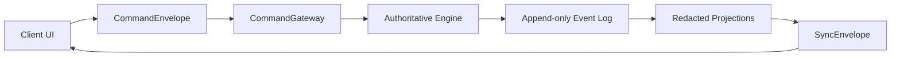
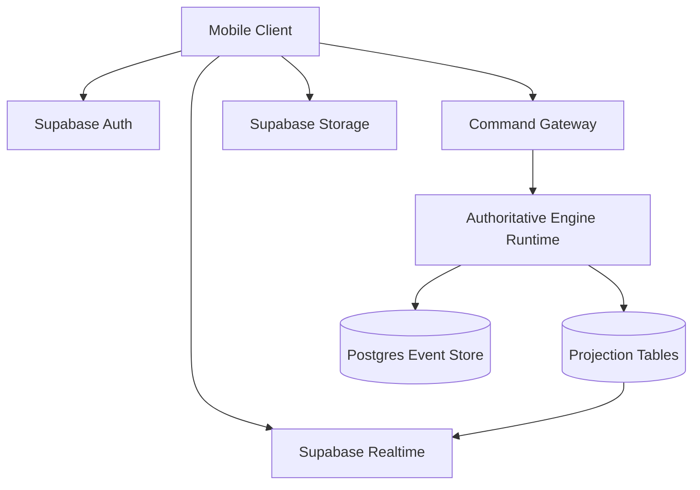

# Transport Architecture

## Purpose

This document defines how the same authoritative game engine is executed and synchronized across:

- online cloud multiplayer using Supabase
- local nearby host-authoritative multiplayer without internet
- single-device referee fallback mode

The transport layer is responsible for delivery, sync, reconnect, and attachment movement. It is not allowed to redefine game rules, timer semantics, or hidden-info policy.

## Shared Transport Model

All three modes use the same conceptual pipeline:

### Shared Interfaces

| Interface | Responsibility |
| --- | --- |
| `TransportAdapter` | Connects the client to the active authority and exposes submit/subscribe/snapshot/upload operations. |
| `CommandGateway` | Accepts `CommandEnvelope`, executes validation and command handling, and returns accepted events or rejection reasons. |
| `SyncEnvelope` | Ships either a full snapshot or event catch-up delta, always scoped to one `ProjectionScope`. |
| `ProjectionScope` | Determines which redacted read model a recipient is allowed to receive. |
| `AttachmentTransfer` | Uploads media, obtains a reference, and exposes role-scoped download access. |

### Proposed `TransportAdapter` Responsibilities

- `connect(sessionConfig)`
- `disconnect()`
- `submit(commandEnvelope)`
- `subscribe(matchId, projectionScope, cursor)`
- `requestSnapshot(matchId, projectionScope, lastKnownVersion)`
- `uploadAttachment(matchId, attachmentDraft, visibilityScope)`
- `getConnectionState()`

The mobile UI only depends on this abstraction. It does not know whether it is speaking to Supabase, a nearby host device, or a single-device authority runtime.

## Authority Model by Mode

| Mode | Authority Runs Where | Trusted Device(s) | Raw Hider Coordinates Live Where | Failure Domain |
| --- | --- | --- | --- | --- |
| Online cloud | server-side command executor | cloud authority only | cloud-only authority storage | cloud outage, auth outage, client disconnect |
| Local nearby | designated host phone | host phone only | host-local authority storage | host device failure, LAN instability |
| Single-device referee | same local device as UI | referee user and device | same device, authority-only in memory/local DB | one-device loss or misuse |

Design rule:

- a device may be trusted as authority in local or referee mode, but guest clients are never trusted with hidden coordinates or authoritative randomness

## Online Cloud Architecture

### Recommended Shape

### Components

#### Supabase Auth

- identity for online users
- maps auth user to player profile
- enforces authenticated command submission

#### Command Gateway

- implemented as Edge Functions or an equivalent server-side authority boundary
- validates command envelopes and session membership
- executes engine handlers
- writes authoritative events and derived projections

#### Postgres Event Store

- append-only `match_events`
- optionally split public and private payload storage if needed for RLS simplicity
- snapshots stored separately for reconnect and rebuild

#### Projection Tables

- role-scoped and match-scoped read models
- optimized for subscription and reconnect
- may include:
  - match summary projection
  - team-private projection
  - player-private projection
  - public event feed projection

#### Supabase Realtime

- broadcasts projection changes or event cursors
- clients use these notifications to fetch the next allowed `SyncEnvelope`
- should not broadcast raw private event payloads directly

#### Supabase Storage

- attachment binaries and derived previews
- signed URLs or short-lived scoped access only
- separate metadata table for visibility and moderation data

### Storage Model

- authoritative event log in Postgres
- projection tables keyed by `matchId + scope`
- snapshots for quick reconnect and log replay acceleration
- hidden coordinates stored in authority-only columns/tables never exposed through client-readable SQL or Realtime subscriptions

### Sync and Reconnect

- client keeps `lastKnownProjectionVersion` and `lastEventSequence`
- on reconnect:
  1. request scoped snapshot if local version is stale or missing
  2. apply delta events/projection updates after that snapshot
  3. reconcile pending local UI intentions using idempotency keys
- offline client commands remain local drafts until connectivity returns and authority accepts them

### Security and Privacy

- use RLS to restrict projection rows by user identity and role
- never expose raw hider coordinates or private hands in client-readable tables
- keep authoritative dice/randomness server-side
- store attachment metadata separately from public URLs
- audit host/admin override commands

### Limitations

- online mode depends on Supabase availability and auth reachability
- live location and image upload can be delayed on weak mobile networks
- strong RLS discipline is required to avoid accidental hidden-info leakage

## Local Nearby Host-Authoritative Architecture

### Recommended Shape

One nearby device becomes host authority. It runs:

- the authoritative engine
- local event storage
- local snapshots
- a LAN-accessible command and sync service

Guest devices join over the same Wi-Fi network or hotspot using:

- QR room code containing host address and join token
- manual room code entry fallback
- optional LAN discovery if the runtime supports it later

### Local Host Runtime

Suggested host components:

- embedded local database such as SQLite for event log and snapshots
- local HTTP API for command submission and attachment upload
- local WebSocket channel for projection updates and presence
- host health monitor and guest heartbeat tracking

### Guest Runtime

Each guest device stores:

- session token and host endpoint
- cached projection snapshots by scope
- unsent command drafts with idempotency keys
- attachment upload retry metadata

### Storage Model

- host device is the source of truth
- guests keep disposable caches only
- hider coordinates remain on the host and are never replicated to guest devices unless the host user is also the hider in referee-like operation

### Sync and Reconnect

- every guest tracks `snapshotVersion` and `eventSequence`
- after reconnect:
  1. guest reauthenticates with join token or local session secret
  2. guest requests the latest allowed snapshot for its scope
  3. guest receives delta events or projection patches after the snapshot version
- if the host app restarts successfully, it restores from local SQLite snapshot plus event log
- if the host device is lost, v1 nearby mode has no automatic host migration

### Security and Privacy

- nearby mode has a weaker trust model than cloud mode because the host phone is fully trusted
- guest devices must still receive only scoped projections
- join tokens should be short-lived and rotated when practical
- LAN traffic should use authenticated messages even if full transport encryption is limited in v1
- attachments should be fetched through authenticated host endpoints, not exposed raw over a shared folder

### Limitations and Tradeoffs

- no seamless authority failover in v1
- LAN discovery and local servers may require Expo prebuild/custom native capability rather than a strict managed-only runtime
- hotspot environments vary by platform and can break device-to-device reachability
- host battery, thermal limits, and backgrounding are meaningful operational risks

## Single-Device Referee Architecture

### Purpose

This is the resilience fallback when multi-device connectivity is unavailable or for testing/debugging. The same engine runs locally on one device, but the UI provides protected reveal/handoff flows rather than network isolation.

### Runtime Shape

- local in-process command gateway
- local event log and snapshots
- no network transport
- same command, event, projection, and visibility contracts as other modes

### Protected Reveal Flows

Single-device mode requires explicit UX protections because secrecy depends on handoff rather than network separation.

Recommended safeguards:

- pass-and-confirm screen before showing role-private data
- screen obfuscation when app backgrounds
- explicit "hide secret now" checkpoints
- separate reveal tokens for hider-only and seeker-only screens
- host/referee acknowledgment before returning to shared/public screens

### Limitations

- secrecy depends partly on user discipline
- live simultaneous usage is not possible
- local notifications, background timers, and attachment capture still matter, but there is no network sync problem

## Shared Sync Contract

`SyncEnvelope` should support both full snapshots and incremental updates.

Recommended fields:

| Field | Notes |
| --- | --- |
| `matchId` | target match/session |
| `projectionScope` | recipient scope for the payload |
| `snapshotVersion` | monotonically increasing projection version |
| `lastEventSequence` | latest event included in the snapshot |
| `baseSnapshotVersion` | previous version the delta is based on |
| `projectionPayload` | full or partial redacted state |
| `eventSummaries` | optional small event feed entries for UI animation/history |
| `requiresResync` | set when the client must discard local cache and fetch a fresh snapshot |

Rules:

- if the client cursor is too old or inconsistent, the authority returns `requiresResync = true`
- event summaries must already be redacted for the receiving scope
- snapshot versions must be monotonic within a scope

## Attachment Strategy

Attachments use one contract but different storage providers by mode.

| Mode | Binary Storage | Metadata Storage | Access Model |
| --- | --- | --- | --- |
| Online cloud | Supabase Storage | Postgres | signed/scoped access |
| Local nearby | host device filesystem or app sandbox | host SQLite | host-authenticated local fetch |
| Single-device | local app sandbox | local DB | same-device access only |

Attachment visibility always follows the same `VisibilityPolicy` rules regardless of mode.

## Reconnect and Recovery Scenarios

The transport design must support these cases:

1. Online client reconnects from an older snapshot and catches up using event/projection deltas.
2. Nearby guest reconnects after temporary LAN loss and restores from the host's latest snapshot.
3. Host app restarts locally and rebuilds the current match from snapshot plus event log.
4. Pending guest command is retried idempotently after reconnect.
5. Attachment upload resumes or fails cleanly without corrupting the match state.
6. If a nearby host is lost permanently, the system surfaces explicit manual recovery guidance rather than pretending failover succeeded.

## Security and Privacy Summary

Non-negotiable rules across all modes:

- seekers never receive raw hider coordinates
- private hands never leak into public or wrong-team projections
- authoritative randomness stays on the authority runtime
- attachment visibility is enforced by scope, not by UI hiding
- exported logs must support role-scoped redaction

Mode-specific trust differences:

- online cloud offers the strongest separation if RLS and server boundaries are correct
- nearby mode trusts the host device but not the guests
- single-device mode trusts the referee device and operator most heavily

## Recommended Phase Order

Transport implementation should follow this order:

1. transport contract and in-memory test adapter
2. online command gateway and scoped sync model
3. local nearby host runtime with snapshot restore
4. single-device referee adapter
5. attachment transport and recovery hardening
